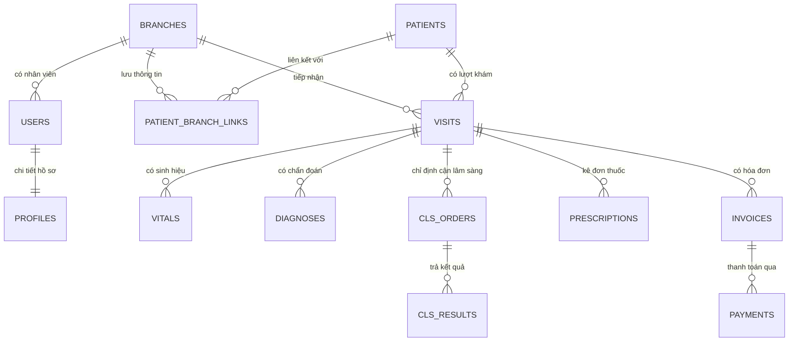

# Cấu Trúc Cơ Sở Dữ Liệu (Database Schema)

Dự án FDcare sử dụng PostgreSQL (thông qua nền tảng Supabase) với 15 bảng cốt lõi. Việc giao tiếp và quản lý schema được thực hiện qua **Drizzle ORM**.

## Sơ Đồ Quan Hệ (ERD - Entity Relationship Diagram)

## Giải Thích Các Bảng Cốt Lõi

1. **`branches`**: Bảng gốc lưu thông tin chi nhánh (Tên, địa chỉ, hotline). Cột `id` của bảng này cực kỳ quan trọng vì nó được dùng làm bộ lọc (filter) mặc định trong toàn bộ các chính sách RLS (Row Level Security).
2. **`users` & `profiles`**: Tài khoản nhân viên. Auth User được quản lý bởi Supabase, trong khi `profiles` lưu trữ vai trò (role) và chi nhánh làm việc (branch_id).
3. **`patients`**: Master Patient Index (MPI), hệ thống lưu trữ tập trung dữ liệu cá nhân của bệnh nhân (chỉ có 1 bản ghi duy nhất trên toàn hệ thống).
4. **`patient_branch_links`**: Bảng trung gian phân quyền. Chi nhánh nào đã từng khám cho bệnh nhân thì mới được phép xem hồ sơ y tế của bệnh nhân đó.
5. **`visits`**: Lượt khám bệnh (Trạng thái: WAITING, IN_PROGRESS, COMPLETED...).
6. **`vitals`**: Các chỉ số sinh hiệu đo được tại mỗi lượt khám (Mạch, Huyết áp, SpO2, Chiều cao, Cân nặng...).

## Cơ Chế RLS (Row Level Security)
Hệ thống KHÔNG dựa vào application-level logic để lọc dữ liệu chi nhánh. Thay vào đó, nó dựa vào **RLS của PostgreSQL**.
Mỗi request từ Next.js sẽ truyền một JSON Web Token (JWT) có chứa thông tin `app_metadata` về `branch_id`. Postgres tự động lọc dữ liệu trước khi trả về, tránh việc rò rỉ dữ liệu giữa các chi nhánh.
